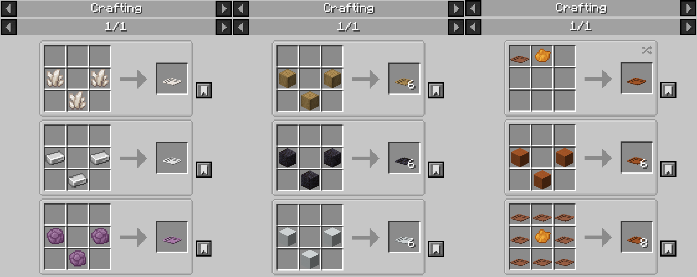

**Eng** | [[Ua](./docs/README_uk_ua.md)] | [[Ru](./docs/README_ru_ru.md)]  

   
  

## Description and Features

Adds various dinnerware to the game (just plates for now).   
Place, display and eat.   
Maybe wash too.  

Detailed description

Plates can be made out of: 
- vanilla wood types (including nether ones and bamboo);
- iron, gold, diamond and quartz (two types);
- terracotta of all colors (both by dyeing plain one and crafting directly out of colored blocks);
- concrete of all colors;
- a few other materials.

Click to expand

  
  

Plates act similar to carpets in regard to placing - can be placed on any block, but break without support.  
**Can be oriented on four cardinal directions and are waterloggable.**  
GUI can be opened by right-clicking on empty one or by shift-right-clicking on any. The plate has three slots: **Main dish**, **Side dish** and **Extra dish**.   
Each slot can hold up to 16 items (can be changed in the config), but it doesn't allow overstacking if certain item's max stack is lower.  

The placed food is rendered on the plate depending on what slots are filled (4 configurations total).

Click to expand

   
  

**Right-click the plate to eat the food off of it.**  
The food can be eaten in three modes:
- Queue: all the food is eaten in the Main dish slot first, then in Side dish slot, then in Extra dish slot;  
- Round Robin: each new right-click will take the food from the new slot. Clicks with no food eaten still count;  
- Aiming (**default**): the food is eaten depending on where and crosshair is aimed at the time of right-click;  

**Any effects it has will be applied to the player, both beneficial AND harmful.** In theory any custom logic from the mods should also work, provided it's encapsulated in the `finishUsingItem()` method.  
By default, the player can only eat until they're full, but over-eating can be enabled in the config.  

Click to expand

  

**By default, only edible items can be places on the plates.** This too can be disabled in the config, allowing to place anything on any plate.  
See [Customization](#customization) for details.  

Click to expand

  

Lastly, if enabled in the config, plates can become fragile. Don't walk on them.  

### Recipes

All plates are crafted with the "bowl" recipe out of plate material. JEI is recommended for viewing the recipes.  
"Item-material" (ingots/gems/quartz/etc.) produce 1 plate while "Block-materials" produce 6 plates.  
Additionally, colored plates (like terracotta ones) can be crafted by coloring the base item.  

Click to expand

  

## Images

Click to expand

  
  
  

## Resourcepack support

Blocks and items reference vanilla textures so whatever resourcepack you install will be applied to the plates as well.  

Barebones
  

Ashen 16x
  

Default HD 128x
  

## Customization

By default, only edible items are allowed on plates. This can be disabled to allow any item/block on the plate.  
If you want to add a few items that are edible, but not compatible by default, they should be added to the `dinnerware:additional_food` tag provided by the mod.  
Note that adding items to this tag does not guarantee they'll be able to be eaten as that still relies on FoodProperties to be present in item.

## Loaders / Versions

Forge 47.4.16+ for Minecraft 1.20.1.  

When the mod is feature-complete I will be looking into forward porting it to 1.21.1 (or maybe 1.21.4?).  
As well as back-porting to Forge 1.18.2. Yes, really.  

Fabric port is father to the back, but not out of the picture. We'll see.

## Potential Plans  

Click to expand
  

Any of these may or may not be implemented, depends.
- Modded materials for plates;
- Different sizes/types of plates;
- Rendering food when in item form in world/inventory;
- Transporting plates with food inside without breaking (maybe on a food tray?).

  

## Credits

* v972 - Initial idea, coding;
* Queez_ - Motivation, assets and creative input;
* Kaupenjoe - Great free modding tutorial series;
* diesieben07 - That one method for shift-right-clicking an item in the GUI;
* Early playtesters - Feedback and bug reports;
