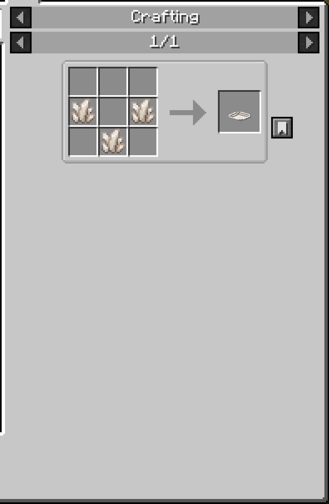
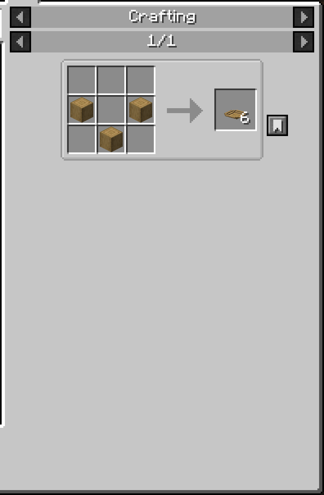
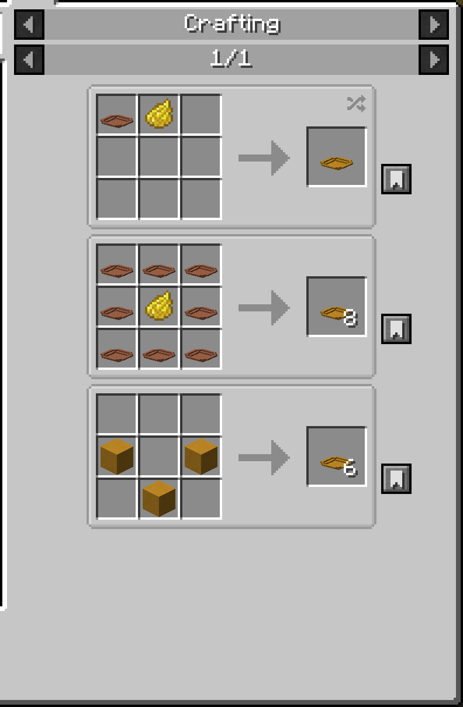

[[Eng](../README.md)] | [[Ua](../docs/README_uk_ua.md)] | **Ru**  

   
  

## Описание и фичи

Добавляет различную посуду (пока только обычные тарелки).   
Можно красиво расставлять, класть еду и есть.   
А может и мыть.  

Детальное описание

Тарелки можно сделать из: 
- ванильных видов дерева (включая адские и бамбук);
- железа, золота, алмаза и кварца в двух видах;
- терракоты/керамики всех цветов (как покраской бесцветной тарелки, так и крафтом из цветных блоков напрямую);
- бетона всех цветов;
- пары-тройки других материалов.

Кликни чтобы развернуть

  
  

Тарелки ведут себя так же как ковры в плане размещения -- их можно ставить на что угодно, но без блока под ними они выпадают.  
**Могут быть поставлены глядя на все четыре стороны и погружены в воду (waterlogged).**  
Интерфейс открывается либо ПКМ по пустой тарелке либо ПКМ в присяде по любой. У тарелки есть три слота: **Основное блюдо**, **Боковое блюдо (гарнир)** and **Доп. блюдо**.   
Каждый слот вмещает в себя до 16 предметов (по умолчанию, можно поменять в конфиге), но если максимальный стак предмета меньше, то более этого положить не выйдет.

Еда на тарелке отображается в зависимости от количества заполненных слотов и что это за слоты (всего 4 конфигурации).

Кликни чтобы развернуть

   
  

**Еду в тарелке можно есть нажатием ПКМ по тарелке.**  
Доступно три режима поедания:
- Очередь (`Queue`): сначала съедается вся еда в слоте основного блюда, затем гарнира, затем доп. блюда;
- "С миру по нитке" (`Round Robin`): каждый клик съедает по одной единице еды с каждого слота по очереди. Даже если еда не съелась, то слот переключается;
- Вручную (`Aiming`) (**по умолчанию**): съедается та еда, на которую нацелено перекрестие во время ПКМ;

**Любые эффекты еды применяются к игроку, как положительные, так и отрицательные.** В теории, любая кастомная логика модовых предметов должна работать "из коробки", при условии, что она написана в `finishUsingItem()` методе.  
По умолчанию, игрок может есть только если голоден, но "переедание" можно включить в конфиге.

Кликни чтобы развернуть

  

**По умолчанию, только съедобные предметы можно положить на тарелки.** Это тоже можно отключить в конфиге, в результате чего на тарелки можно будет класть всё что угодно.  
Детали в разделе [Кастомизация](#кастомизация).  

Кликни чтобы развернуть

  

Напоследок, если включить в конфиге соответствующую настройку, то тарелки станут хрупкими. Не ходите по ним.  

### Рецепты крафта

Все тарелки крафтятся рецептом миски, выложенным из материала тарелки. Рекомендуется использовать JEI.  
"Материалы-предметы" (слитки/гемы/кварц/т.д.) производят 1 тарелку, а "материалы-блоки" производят 6 тарелок.  
В добавок, цветные керамические тарелки можно скрафтить, используя бесцветную керамическую тарелку и краситель.  

Кликни чтобы развернуть

<table>
<tr>

<td>

</td>

<td>

</td>

<td>

</td>

</tr>
</table>  

## Изображения

Кликни чтобы развернуть

  
  

## Поддержка ресурспаков

Блоки и предметы в моде используют ванильные текстуры и подстроятся под установленные ресурспаки.  

Barebones
  

Ashen 16x
  

Default HD 128x
  

## Кастомизация

По умолчанию, только съедобные предметы можно положить на тарелки. Это тоже можно отключить в конфиге, в результате чего на тарелки можно будет класть всё что угодно.  
Если же нужно добавить несколько съедобных предметов, которые почему-то не распознались, то их следует добавить в тег мода `dinnerware:additional_food`.  
Учтите, что выключение настройки и/или добавление в тег не гарантирует, что предмет можно будет съесть, так как это всё ещё опирается на наличие свойства FoodProperties в предмете.

## Загрузчики / версии

Forge 47.4.16+ для Майнкрафта версии 1.20.1.  

Когда мод будет дописан с точки зрения контента (станет "feature-complete"), то я планирую портировать его на на 1.21.1 (или может 1.21.4?).  
А ещё бекпортить на Forge 1.18.2. Да, серьёзно.  

Порт на Фабрик ниже в приоритете и дальше во времени, хоть от него пока не отказываюсь. Поглядим.

## Планы на будущее

Кликни чтобы развернуть
  

Пункты ниже все под вопросом и могут не быть реализованы.
- Посуда из модовых материалов;
- Посуда разных размеров/видов;
- Отображение еды в тарелке в виде вещи в инвентаре/мире;
- Перенос тарелок с сохранением еды внутри без разбивания тарелки (например на подносе?)

  

## Авторы и помогшие

* v972 - Идея мода, программирование;
* Queez_ - Мотивация, ассеты и творческий вклад;
* Kaupenjoe - Отличная серия видео-туторилов;
* diesieben07 - Код перемещения предмета в интерфейсе по шифт-клику;
* Ранние бета-тостеры - Отзывы и отлов багов;
