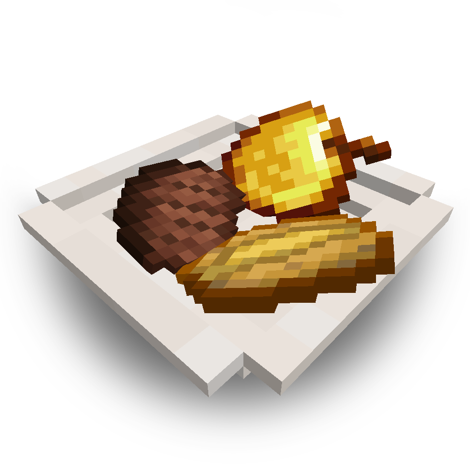

[[Eng](../README.md)] | [[Ua](../docs/README_uk_ua.md)] | **Ru**  

   
  

## Описание и фичи

Добавляет различную посуду (пока только обычные тарелки).   
Можно красиво расставлять, класть еду и есть.   
А может и мыть.  

Детальное описание можно найти на [ГитХаб-вики](https://github.com/V972/dinnerwareMod/wiki/Home_Ru)

## Изображения

Кликни чтобы развернуть

  
  
  

## Загрузчики / версии

|          | 1.18.2 | 1.19.2 | 1.20.1 | 1.21.1 |
|----------|--------|--------|--------|--------|
| Forge    |   ✅    |   ✅    |   ✅    |        |
| Neoforge |        |        |        |   ✅    |
| Fabric   |   ✅    |   ✅    |   ✅    |   ✅    |
*На момент составления таблицы версии, помимо 1.20.1 находятся в разработке.

## Планы на будущее и известные баги

Планы
  

Пункты ниже все под вопросом и могут не быть реализованы.
- Посуда из модовых материалов;  
- Посуда разных размеров/видов;  
- предоставить стойкую [и желательно юзеро-расширяемую] систему хендлинга нестандартных модовых предметов пищи;
- ГУЙ и в целом возможность менять верхний стак тарелок в подносе а-ля колчан из Supplementaries.

  

Известные Баги
  

- Тарелки, которые крафтятся из теговых ингредиентов (слитки/гемы) неправильно открывают свой рецепт. На это пофиг 90% игроков, но те 10% никуда не деваются, так что я попробую что-то с этим сделать.

  

## Авторы и помогшие

* v972 - Идея мода, программирование;
* Queez_ - Мотивация, ассеты и творческий вклад;
* [Kaupenjoe](https://www.youtube.com/playlist?list=PLKGarocXCE1H9Y21-pxjt5Pt8bW14twa-) - Отличная серия видео-туторилов;
* [andrew0030](github.com/andrew0030) - Кастомная система BEWLR и советы/помощь в целом;
* diesieben07 - Код перемещения предмета в интерфейсе по шифт-клику;
* Ранние бета-тостеры (AmalgaMaid, EtheryalFalcon и другие) - Отзывы и отлов багов;
