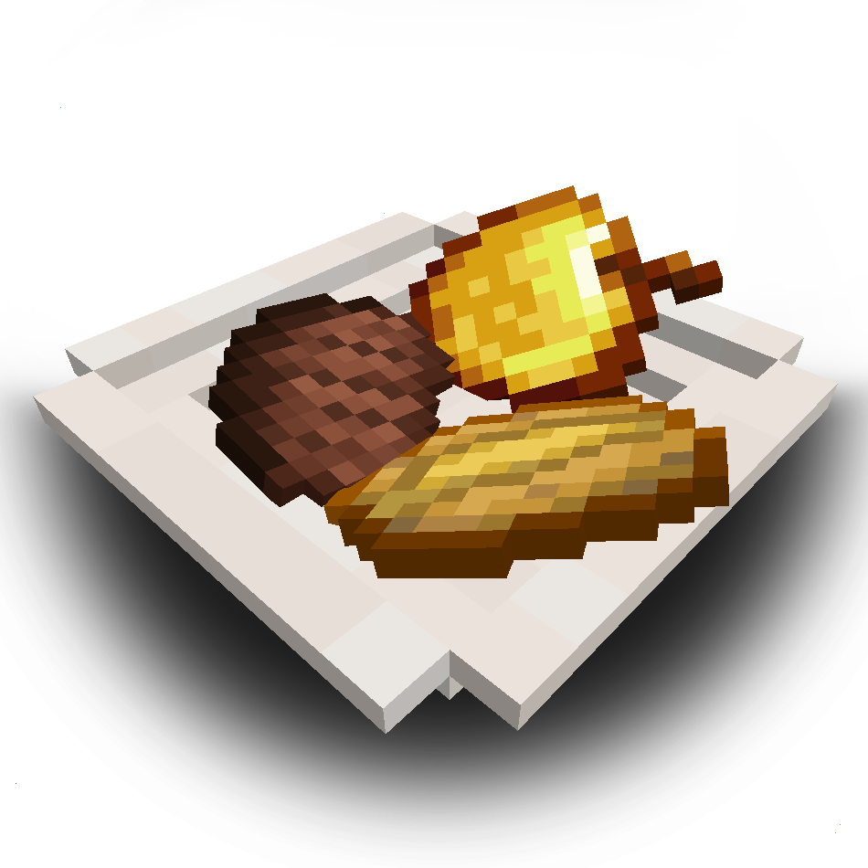
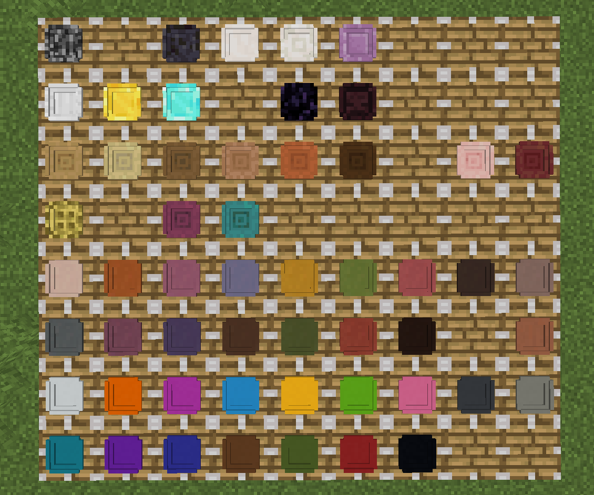
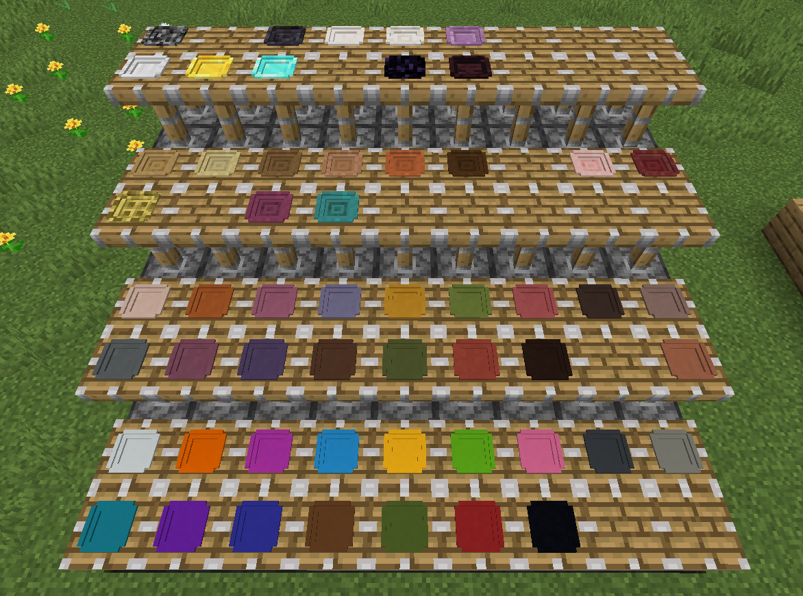
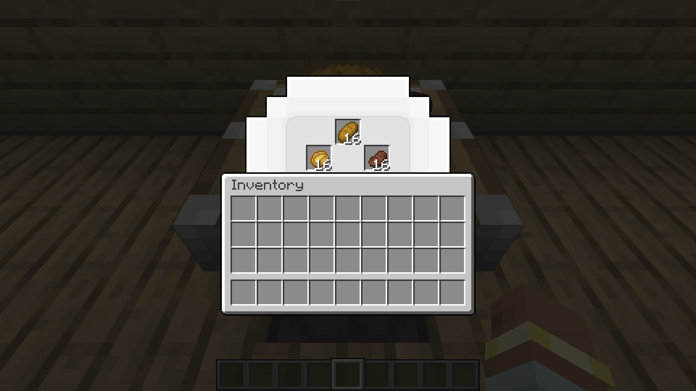
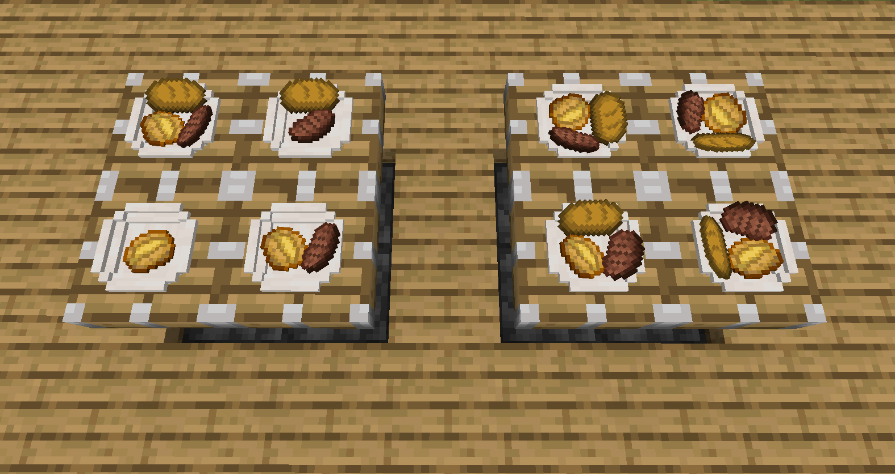
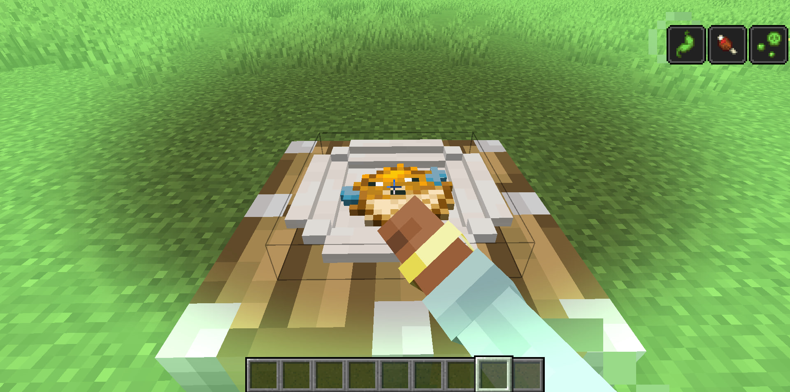
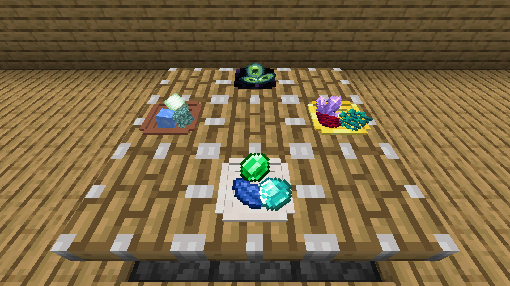
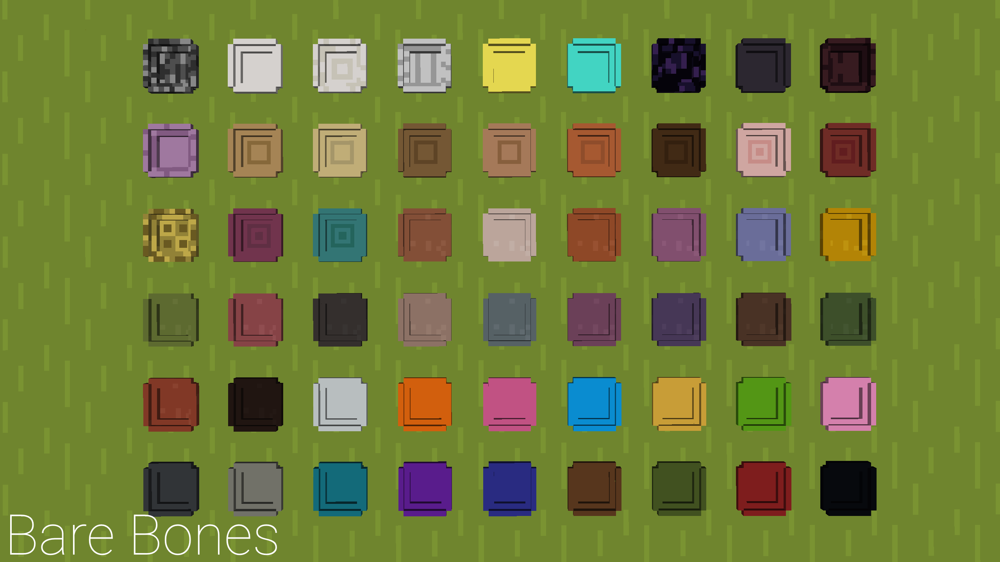
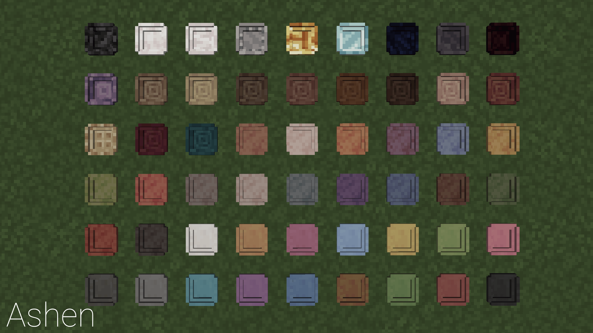
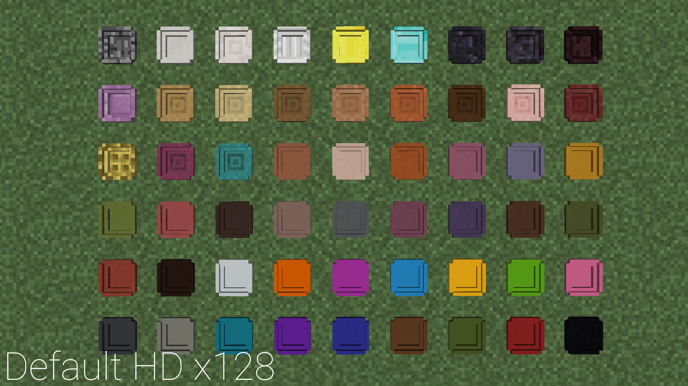

[[Eng](../README.md)] | **Ua** | [[Ru](../docs/README_ru_ru.md)]

   
  

## Опис та фічі

Додає різний посуд (поки що тільки звичайні тарілки).  
Можна красиво розставляти, класти їжу та їсти.  
А може й мити.  

Детальний опис
  

Тарілки можна зробити з:
- ванільних видів дерева (включаючи незерські/пекельні та бамбук);
- заліза, золота, алмазу та кварцу у двох видах;
- теракоти/кераміки всіх кольорів (як фарбуванням безбарвної тарілки, так і крафтом безпосередньо із кольорових блоків);
- бетону всіх кольорів;
- пари-трійки інших матеріалів.

Натисніть щоб розгорнути

  
  

Тарілки поводяться так само як килими в плані розміщення - їх можна ставити на будь-що, але без блоку під ними вони випадають.
**Можуть бути поставлені дивлячись на всі чотири сторони та занурені у воду (waterlogged).**
Інтерфейс відкривається або ПКМ по порожній тарілці або ПКМ в присяді по будь-якій. У тарілки є три слоти: **Основна страва**, **Бічна страва (гарнір)** and **Дод. страва**.
Кожен слот вміщує до 16 предметів (за умовчанням, можна поміняти в конфізі), але якщо максимальний стак предмета менше, то більше цього покласти не вийде.

Їжа на тарілці відображається залежно від кількості заповнених слотів і що за слоти (всього 4 конфігурації).

Натисніть щоб розгорнути

   
  

Тарілки (зазвичай) розбиваються миттєво (в т.ч. поршнями чи вибухами) та їжа всередині випадає.  
При цьому, якщо "розбити" тарілку в присяді, то натомість тарілка "підбереться" з їжею всередині. Їжа в тарілці все також відображатиметься.  

Натисніть щоб розгорнути

https://github.com/user-attachments/assets/a0c89c09-796a-4a2c-b504-01a7dcfdc5e1

**Їжу в тарілці можна їсти натисканням ПКМ по тарілці.**
Доступно три режими поїдання:
- Черга (Queue): спочатку з'їдається вся їжа в слоті основної страви, потім гарніру, потім дод. страви;
- "З миру по нитці" (Round Robin): кожен клік з'їдає по одній одиниці їжі з кожного слота по черзі. Навіть якщо їжа не з'їлася, то слот перемикається;
- Вручну (`Aiming`) (**за замовчуванням**): з'їдається та їжа, на яку націлено перехрестя під час ПКМ;

**Будь-які ефекти їжі застосовуються до гравця, як позитивні, так і негативні.** Теоретично, будь-яка кастомна логіка модових предметів повинна працювати "з коробки", за умови, що вона написана в `finishUsingItem()` методі.
За замовчуванням, гравець може їсти тільки якщо голодний, але "переїдання" можна увімкнути в конфізі.

Натисніть щоб розгорнути

  

**За замовчуванням, тільки їстівні предмети можна покласти на тарілки.**
Деталі у розділі [Кастомізація](#кастомізація).  

Натисніть щоб розгорнути

  

Насамкінець, якщо включити у конфізі відповідне налаштування, то тарілки стануть крихкими. Не ходіть ними.  

### Рецепти крафту

Усі тарілки крафтяться рецептом миски, викладеним із матеріалу тарілки. Рекомендується використовувати JEI.
"Матеріали-предмети" (зливки/геми/кварц/т.д.) виробляють 1 тарілку, а "матеріали-блоки" виробляють 6 тарілок.
Крім того, кольорові керамічні тарілки можна скрафтити, використовуючи безбарвну керамічну тарілку і барвник.

Натисніть щоб розгорнути

  

## Зображення  

Натисніть щоб розгорнути

  
  
  

## Підтримка ресурспаків

Блоки й предмети в моді використовують ванільні текстури та підлаштовуються під встановлені ресурспаки.  

Barebones
  

Ashen 16x
  

Default HD 128x
  

## Кастомізація

За умовчанням лише їстівні предмети можна покласти на тарілки. Це теж можна відключити в конфізі, внаслідок чого на тарілки можна буде класти все, що завгодно.  
Якщо ж потрібно додати кілька їстівних предметів, які чомусь не розпізналися, їх слід додати в тег мода `dinnerware:additional_food`.  
Зверніть увагу, що вимкнення налаштування та/або додавання в тег не гарантує, що предмет можна буде з'їсти, оскільки це все ще спирається на наявність властивості FoodProperties у предметі.  

## Лоадери / версії  

Forge 47.4.16+ для Майнкрафт версії 1.20.1.

Коли мод буде дописано з погляду контенту (стане "feature-complete"), то я планую портувати його на 1.21.1 (або може 1.21.4?).  
А ще експортувати на Forge 1.18.2. Так, серйозно.  

Порт на Фабрик нижчий у пріоритеті й далі в часі, хоч від нього поки що не відмовляюся. Подивимося.  

## Плани на майбутнє 

Натисніть щоб розгорнути
  

Пункти нижче все під питанням і можуть не бути реалізовані.
- Посуд із модових матеріалів;
- Посуд різних розмірів/видів;
- ~~Відображення їжі в тарілці у вигляді речі в інвентарі/світі;~~
- ~~Перенесення тарілок зі збереженням їжі всередині без розбивання тарілки (наприклад, на таці?)~~

  

## Автори та ті, хто допоміг

* v972 - Ідея мода, програмування;
* Queez_ - мотивація, асети та творчий внесок;
* Kaupenjoe - чудова серія відео-туторилів;
* diesieben07 - Код переміщення предмета в інтерфейсі по шифт-кліку;
* Ранні бета-тостери (AmalgaMaid, EtheryalFalcon та інші) - Відгуки та вилов багів;
